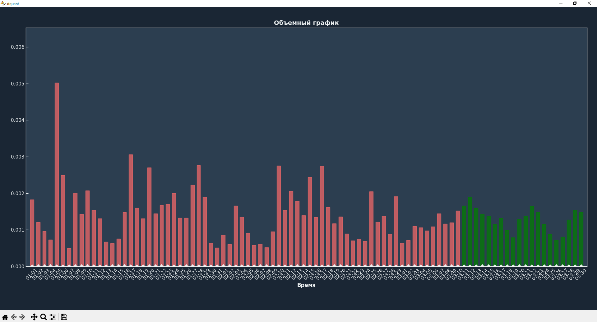

# DQuant Library Documentation

**Version:** 1.1.2  
**License:** MIT  
**GitHub:** [github.com/artrdon/dquant](https://github.com/artrdon/dquant)  
**PyPI:** [pypi.org/project/dquant](https://pypi.org/project/dquant)  

---

## Table of Contents

1. [Introduction](#1-introduction)
   - 1.1 [What is DQuant?](#11-what-is-DQuant)
   - 1.2 [Key Features](#12-key-features)
   - 1.3 [Who is this library for](#13-who-is-this-library-for)
   - 1.4 [Philosophy](#14-philosophy)
2. [Installation](#2-installation)
   - 2.1 [Requirements](#21-requirements)
   - 2.2 [Installation via pip](#22-installation-via-pip)
   - 2.3 [Verifying Installation](#23-verifying-installation)
3. [Quick Start](#3-quick-start)
   - 3.1 [Minimal Example](#31-minimal-example)
   - 3.2 [Step-by-Step Breakdown](#32-step-by-step-breakdown)
4. [Core Concepts](#4-core-concepts)
   - 4.1 [Input Data](#41-input-data)
   - 4.2 [Target Variable](#42-target-variable)
   - 4.3 [Feature Engineering](#43-feature-engineering)
   - 4.4 [Training and Validation](#44-training-and-validation)
   - 4.5 [Visualization](#45-visualization)
   - 4.6 [Saving and Loading Models](#46-saving-and-loading-models)
5. [User Guide](#5-user-guide)
   - 5.1 [VolClustGB, VolClustXGB, VolClustLightGBM Classes](#51-volclustgb-volclustxgb-volclustlightgbm-classes)
     - 5.1.1 [Initialization Parameters](#511-initialization-parameters)
     - 5.1.2 [fit Method](#512-fit-method)
     - 5.1.3 [forecast Method](#513-forecast-method)
     - 5.1.4 [save Method](#514-save-method)
     - 5.1.5 [load Method](#515-load-method)
     - 5.1.6 [show_train_results Method](#516-show_train_results-method)
   - 5.2 [Working with Different Data Sources](#52-working-with-different-data-sources)
     - 5.2.1 [Yahoo Finance](#521-yahoo-finance)
     - 5.2.2 [MetaTrader 5](#522-metatrader-5)
     - 5.2.3 [Other Sources](#523-other-sources)
   - 5.3 [Interpreting Results](#53-interpreting-results)
6. [Advanced Usage](#6-advanced-usage)
   - 6.1 [Customizing Feature Engineering](#61-customizing-feature-engineering)
     - 6.1.1 [Passing a Custom Function](#611-passing-a-custom-function)
   - 6.2 [Model Hyperparameter Tuning](#62-model-hyperparameter-tuning)
7. [Usage Examples](#7-usage-examples)
   - 7.1 [Bitcoin Volatility Forecast](#71-bitcoin-volatility-forecast)
8. [Frequently Asked Questions (FAQ)](#8-frequently-asked-questions-faq)
   - 8.1 [General Questions](#81-general-questions)
   - 8.2 [Data Questions](#82-data-questions)
   - 8.3 [Model Questions](#83-model-questions)
9. [Contributing](#9-contributing)
    - 9.1 [How to Report a Bug](#91-how-to-report-a-bug)
    - 9.2 [Suggesting New Features](#92-suggesting-new-features)
10. [License](#10-license)
11. [Changelog](#13-changelog)

---

## 1. Introduction

### 1.1 What is DQuant?

**DQuant** is an open-source Python library for automated volatility forecasting of financial time series using machine learning methods. The library handles all stages of model building: from raw price data to ready-made forecasts, hiding technical details (feature engineering, data splitting, visualization), while still allowing flexible customization for experienced users.

Key idea: **a trader doesn't need to know machine learning to use AI for volatility forecasting.**

### 1.2 Key Features

- **Automated feature engineering** — creates dozens of features from raw price data.
- **Automated target variable construction** — calculates realized volatility over a given horizon without look-ahead bias.
- **Intelligent data splitting** — preserves temporal structure when splitting into train/validation.
- **Gradient Boosting/XGBoost/LightGBM** with early stopping.
- **Training visualization** — error plot on training and validation sets.
- **Save and load models** — train once, use forever.
- **Flexible customization** — your own features, model parameters.
- **Integration with any data source** — Yahoo Finance, MetaTrader 5, and others.

### 1.3 Who is this library for

| Audience | Why they need DQuant                                   |
|:---|:-------------------------------------------------------|
| **Traders (algorithmic)** | For model calibration, risk management, setting stops  |
| **Traders (discretionary)** | For assessing market regime, determining position size |
| **Quantitative analysts** | For rapid volatility model prototyping                 |
| **Trading system developers** | For embedding forecasts into their pipelines           |
| **Students and researchers** | As a ready-made benchmark and learning example         |

### 1.4 Philosophy

DQuant is built on three principles:

1. **Simplicity for beginners** — you don't need to be a data scientist to use the library.
2. **Power for professionals** — flexible customization for those who want to dig deeper.
3. **Transparency** — you always see what's happening (graphs, metrics) and can interpret the results.

---

## 2. Installation

### 2.1 Requirements

- Python 3.7 or higher
- pip (Python package manager)

**Dependencies (installed automatically):**
- `cycler >= 0.11.0`
- `joblib >= 1.2.0`
- `lightgbm >= 3.3.0`
- `matplotlib >= 3.5.0`
- `numpy >= 1.21.0`
- `onnx >= 1.14.0`
- `onnxruntime >= 1.15.0`
- `pandas >= 1.5.0`
- `scikit-learn >= 1.2.0`
- `skl2onnx >= 1.14.0`
- `xgboost >= 1.7.0`
- `onnxconverter-common >= 1.9.0`
- `onnxmltools >= 1.11.0`

### 2.2 Installation via pip

```bash
pip install dquant
```

### 2.3 Verifying Installation

```python
import dquant
print(dquant.__version__)
# Should output the version
```

---

## 3. Quick Start

### 3.1 Minimal Example

```python
import pandas as pd
import yfinance as yf
from dquant.models import VolClustXGB 

# 1. Load data
df = yf.download("BTC-USD", start="2020-01-01", interval='1d')
df = pd.DataFrame({
    'open': df[('Open', 'BTC-USD')].values,
    'high': df[('High', 'BTC-USD')].values,
    'low': df[('Low', 'BTC-USD')].values,
    'close': df[('Close', 'BTC-USD')].values,
    'volume': df[('Volume', 'BTC-USD')].values
}, index=df.index)

# 2. Create model
model = VolClustXGB({}, early_stopping=True)

# 3. Train model
features = [
    'TR',
    'returns',
    'abs_returns',
    'gap',
    'body',
    'shadow',
    'close_position',
    'roll_atr_14'
]
model.fit(df, feature_list=features, input_bars=70, horizon=20, trees_count=200, show_results=True)


# 4. Make forecast
rez = model.forecast(df.iloc[-70:].copy(), show=True)
```

### 3.2 Step-by-Step Breakdown

**Step 1: Loading Data**
```python
df = yf.download("BTC-USD", start="2020-01-01", interval='1d')
```
We use Yahoo Finance to get historical data. Then we create a new DataFrame based on our data:
```python
df = pd.DataFrame({
    'open': df[('Open', 'BTC-USD')].values,
    'high': df[('High', 'BTC-USD')].values,
    'low': df[('Low', 'BTC-USD')].values,
    'close': df[('Close', 'BTC-USD')].values,
    'volume': df[('Volume', 'BTC-USD')].values
}, index=df.index)
```

The result is a pandas DataFrame with columns open, high, low, close, volume.

**Step 2: Creating the Model**
```python
model = VolClustXGB({}, early_stopping=True)
```
Initialize the model with default parameters and early stopping.

**Step 3: Training**
```python
features = [
    'TR',
    'returns',
    'abs_returns',
    'gap',
    'body',
    'shadow',
    'close_position',
    'roll_atr_14'
]
model.fit(df, feature_list=features, input_bars=70, horizon=20, trees_count=200, show_results=True)
```
- `input_bars=70` — how many candles to use as input data
- `horizon=20` — forecast volatility for the next 20 days
- `trees_count=200` — maximum number of trees in gradient boosting
- `show_results=True` — show error plot after training

After training, an error plot for train and validation will automatically appear.

**Step 4: Forecast**
```python
rez = model.forecast(df.iloc[-70:].copy(), show=True)
```
Pass the last 70 candles, get volatility forecast for the next 20 days.

The volatility forecast will be displayed as a graph.

Red shows volatility for previous candles, green shows future volatility.

---

## 4. Core Concepts

### 4.1 Input Data

**DataFrame Requirements:**

- Must contain price columns: `open`, `high`, `low`, `close`, `volume` (when using volume features), `time` (when using time features)
- Data must be sorted in ascending time order (from past to future)

**Example of a correct DataFrame:**

| time                | open  | high  | low   | close | volume |
|:--------------------|:------|:------|:------|:------|:-------|
| 2020-01-02 00:00:00 | 100.0 | 102.0 | 99.5  | 101.5 | 1000000|
| 2020-01-03 01:00:00 | 101.5 | 103.0 | 100.5 | 102.0 | 1100000|
| ...                 | ...   | ...   | ...   | ...   | ...    |

### 4.2 Target Variable

The target variable is the **normalized True Range (TR)** for each candle over the forecast horizon.

TR calculation for a single candle:

```
TR = max(high - low, |high - close_prev|, |low - close_prev|) / close
```

where:
- `high - low` — current candle's range
- `|high - close_prev|` — gap from high to previous close
- `|low - close_prev|` — gap from low to previous close
- `close` — current candle's closing price (normalizing factor)

For the first candle in the window where there is no previous close, only the `high - low` range is used.

Normalization by closing price makes TR **scale-invariant**: the value is expressed as a fraction of the current price, allowing correct comparison of volatility at different price levels.

The function returns an array of normalized TR for all candles in the window.

### 4.3 Feature Engineering

You can select the following feature groups for training:

| Feature | Description | Formula |
|---------|------------------------------------------------------------------|---------|
| `TR` | True Range, normalized by closing price | `max(high-low, \|high-prev_close\|, \|low-prev_close\|) / close` |
| `high_low` | High-low range, normalized | `(high - low) / close` |
| `parkinson` | Parkinson volatility | `√((1 / (4 * log(2))) * (log(high / low))²)` |
| `garman_klass` | Garman-Klass volatility | `√(0.5 * log(high/low)² - (2*log(2)-1) * log(close/open)²)` |
| `rogers_satchell` | Rogers-Satchell volatility | `√(log(high/open)*(log(high/open)-log(close/open)) + log(low/open)*(log(low/open)-log(close/open)))` |
| `return` | Logarithmic return | `log(close / prev_close)` |
| `abs_return` | Absolute return value | `\|return\|` |
| `gap` | Gap between open and previous close | `(open - prev_close) / close` |
| `body` | Candle body | `\|close - open\| / close` |
| `shadow` | Total shadow length (upper + lower) | `((high - max(open,close)) + (min(open,close) - low)) / close` |
| `close_position` | Close position within candle range | `(close - low) / (high - low)` |
| `month` | Month (single value, not time series) | `datetime.month` |
| `day_of_month` | Day of month (single value) | `datetime.day` |
| `day_of_week` | Day of week (single value, 1-7) | `datetime.weekday() + 1` |
| `hour` | Hour (single value) | `datetime.hour` |
| `roll_month` | Month (for each candle) | `datetime.dt.month` |
| `roll_day_of_month` | Day of month (for each candle) | `datetime.dt.day` |
| `roll_day_of_week` | Day of week (for each candle, 1-7) | `datetime.dt.weekday` |
| `roll_hour` | Hour (for each candle) | `datetime.dt.hour` |
| `rsi_{window}` | Relative Strength Index (RSI) for the last value | `100 - (100 / (1 + RS))`, where `RS = avg_gain / avg_loss` |
| `atr_{window}` | Average True Range (ATR) for the last value | `average(TR) / close` |
| `bb_{window}` | Bollinger Bands (simplified) for the last value | `(4 * std) / (sma + ε)` |
| `roll_rsi_{window}` | Relative Strength Index (RSI) for each candle | `100 - (100 / (1 + RS))` with rolling window |
| `roll_atr_{window}` | Average True Range (ATR) for each candle | `rolling_mean(TR) / close` |
| `roll_bb_{window}` | Bollinger Bands (simplified) for each candle | `(4 * rolling_std) / (rolling_sma + ε)` |

- `ε` (epsilon) - a small constant to avoid division by zero
- All features with the `roll_` prefix are calculated as a time series (for each candle)
- Features without the `roll_` prefix (except basic `TR`, `return`, `abs_return`, `gap`, `body`, `shadow`, `close_position`) return only the last value
- All price-related features are divided by the current closing price. This makes them scale-invariant and allows the model to work with different instruments and price levels.

### 4.4 Training and Validation

During training, data is automatically split into training and validation sets:

- Default: the last 20% of data is used for validation
- Temporal order is preserved (no random shuffling)
- Error is tracked on the validation set for early stopping

### 4.5 Visualization

After training, a graph is automatically generated:

- Blue line — error on the training set
- Orange line — error on the validation set

The graph helps:
- Visually assess overfitting (when validation error starts to increase)
- Choose the optimal number of trees
- Ensure the model is learning adequately

### 4.6 Saving and Loading Models

Trained models can be saved and loaded:

```python
# Saving
model.save("btc_vol_model")

# Loading
model.load("btc_vol_model")
```

When saving, the following are preserved:
- Models
- Feature normalization parameters

---

## 5. User Guide

### 5.1 VolClustGB, VolClustXGB, VolClustLightGBM Classes


| Object | Description |
|:-------------------|:---|
| `__version__` | Library version |
| `VolClustGB` | Class for volatility forecasting using Gradient Boosting |
| `VolClustXGB` | Class for volatility forecasting using XGBoost |
| `VolClustLightGBM` | Class for volatility forecasting using LightGBM |

#### 5.1.1 Initialization Parameters

| Parameter | Type | Default | Description |
|:-----------------|:---|:-------------------------------------|:---|
| `sett` | dict | `Default model hyperparameters` | Model hyperparameters |
| `early_stopping` | bool | `True` | Enable early stopping |

**Example:**
```python
model = VolClustGB({}, early_stopping=True)
```

#### 5.1.2 fit Method

```python
features = [
    'TR',
    'returns',
    'abs_returns',
    'gap',
    'body',
    'shadow',
    'close_position',
    'roll_atr_14'
]
model.fit(
    df,
    feature_list=features,
    input_bars=70, 
    horizon=20, 
    trees_count=200, 
    show_results=True
)
```

**Parameters:**

| Parameter | Type | Default | Description |
|:---------------|:-------------|:-------------|:--------------------------------------------------------------------|
| `data` | pd.DataFrame | required | Input data |
| `feature_list` | list | required | Features for training |
| `input_bars` | int | required | Number of candles used for forecasting |
| `horizon` | int | required | Forecast horizon (number of steps ahead) |
| `trees_count` | int | required | Maximum number of trees |
| `show_results` | bool | False | Whether to show the plot after training |
| `feature_func` | function | None | Use custom function for feature creation |
| `target_func` | function | None | Use custom function for target creation |

#### 5.1.3 forecast Method

```python
prediction = model.forecast(df)
```

**Parameters:**

| Parameter | Type | Default | Description |
|:---|:-------------|:-----------------------------------------------------------------------|:-------------------------------------------------------------------------------------------------------------------|
| `latest_data` | pd.DataFrame | required | Data for forecast (must contain same columns as during training) |
| `feature_func` | function | None (required if custom function was used during training) | Use custom function for feature creation if a custom function was used during training |
| `show` | bool | False | Display forecast results |

Returns volatility forecast for the horizon specified during training.

#### 5.1.4 save Method

```python
model.save('name')
```

**Parameters:**

| Parameter | Type | Default | Description |
|:---|:---|:-------------|:-----------------------------------------------------|
| `name` | str | required | Name under which to save the directory and models |
| `type_to_save` | str | 'default' | Format to save models ('default', 'mql5') |

**Saving to mql5**

```python
model.save('name', type_to_save='mql5')
```
Done! Now you can use your trained models in Meta Trader 5.

#### 5.1.5 load Method

```python
model.load('name')
```

**Parameters:**

| Parameter | Type | Default | Description |
|:---|:---|:---|:---|
| `name` | str | required | Name of the directory with saved models |

#### 5.1.6 show_train_results Method

```python
model.show_train_results()
```

Shows the error plot after training.

### 5.2 Working with Different Data Sources

#### 5.2.1 Yahoo Finance

```python
import pandas as pd
import yfinance as yf
from dquant.models import VolClustGB, VolClustXGB, VolClustLightGBM

# Download data
df = yf.download("BTC-USD", start="2020-01-01", end="2024-01-01")
df = pd.DataFrame({
    'open': df[('Open', 'BTC-USD')].values,
    'high': df[('High', 'BTC-USD')].values,
    'low': df[('Low', 'BTC-USD')].values,
    'close': df[('Close', 'BTC-USD')].values,
    'volume': df[('Volume', 'BTC-USD')].values
}, index=df.index)

# Train model
model = VolClustXGB({}, early_stopping=True)
features = [
    'TR',
    'returns',
    'abs_returns',
    'gap',
    'body',
    'shadow',
    'close_position',
    'roll_atr_14'
]
model.fit(df, feature_list=features, input_bars=70, horizon=20, trees_count=200, show_results=True)
```

#### 5.2.2 MetaTrader 5

```python
import MetaTrader5 as mt5
import pandas as pd
import datetime as dt
from dquant.models import VolClustGB, VolClustXGB, VolClustLightGBM


symbol = "GOLD"          # which symbol to watch
timeframe = mt5.TIMEFRAME_D1   # M1, M5, M15, H1, D1, etc.
days_back = 3000             # how many days of history to load


# Connect to MT5
if not mt5.initialize():
    print("Failed to connect to MetaTrader5")
    quit()

# Check that symbol is available
if not mt5.symbol_select(symbol, True):
    print(f"Symbol {symbol} not found or not enabled")
    mt5.shutdown()
    quit()

# Calculate dates
to_date = dt.datetime.now() + dt.timedelta(hours=3)
from_date = to_date - dt.timedelta(days=days_back)

# Load bars
rates = mt5.copy_rates_range(symbol, timeframe, from_date, to_date)

mt5.shutdown()  # terminal no longer needed

if rates is None or len(rates) == 0:
    print("No data!")
    quit()

# Convert to DataFrame
df = pd.DataFrame(rates)
df['time'] = pd.to_datetime(df['time'], unit='s')  # correct time


df.rename(columns={
    'tick_volume': 'volume'
}, inplace=True)

# Train model
model = VolClustXGB({}, early_stopping=True)
features = [
    'TR',
    'returns',
    'abs_returns',
    'gap',
    'body',
    'shadow',
    'close_position',
    'roll_atr_14'
]
model.fit(df, feature_list=features, input_bars=70, horizon=20, trees_count=200, show_results=True)
```

#### 5.2.3 Other Sources

The library accepts any pandas DataFrame with price columns.

### 5.3 Interpreting Results

```
model.forecast(data, show=True)
```
Displays the forecast result on a graph


---

## 6. Advanced Usage

### 6.1 Customizing Feature Engineering

#### 6.1.1 Passing a Custom Function

You can pass your own function for feature creation:

```python
def my_features(df):
    df = df.copy()
    
    # My unique features
    df['my_ratio'] = (df['high'] - df['low']) / df['close']
    df['my_momentum'] = df['close'].pct_change(5)
    df['my_volume_ratio'] = df['volume'] / df['volume'].rolling(20).mean()
    
    return df.dropna()

model.fit(
    df, 
    input_bars=70, 
    horizon=20, 
    trees_count=200, 
    show_results=True,
    feature_func=my_features
)
```

### 6.2 Model Hyperparameter Tuning

The library uses GradientBoostingRegressor, XGBRegressor, and LGBMRegressor models from the sklearn, xgboost, and lightgbm libraries respectively. Hyperparameters are tuned according to these libraries.

---

## 7. Usage Examples

### 7.1 Bitcoin Volatility Forecast

```python
import pandas as pd
import yfinance as yf
from dquant.models import VolClustGB, VolClustXGB, VolClustLightGBM


# 1. Load data
df = yf.download("BTC-USD", start="2020-01-01", interval='1d', auto_adjust=True)
df = pd.DataFrame({
    'open': df[('Open', 'BTC-USD')].values,
    'high': df[('High', 'BTC-USD')].values,
    'low': df[('Low', 'BTC-USD')].values,
    'close': df[('Close', 'BTC-USD')].values,
    'volume': df[('Volume', 'BTC-USD')].values
}, index=df.index)

# 2. Create model
model = VolClustXGB({}, early_stopping=True)

# 3. Train model
features = [
    'TR',
    'returns',
    'abs_returns',
    'gap',
    'body',
    'shadow',
    'close_position',
    'roll_atr_14'
]
model.fit(df, feature_list=features, input_bars=70, horizon=20, trees_count=200, show_results=True)

# 4. Make forecast
rez = model.forecast(df.iloc[-70:].copy(), show=True)
```

---

## 8. Frequently Asked Questions (FAQ)

### 8.1 General Questions

**Q: Why should I forecast volatility?**

A: Volatility is used for:
- Risk management (stop-losses, position sizing)
- Strategy selection (some strategies work in high volatility, others in low volatility)
- Fair price assessment (strong movements relative to expected volatility may be signals)
- Hedging

**Q: How is DQuant different from other volatility forecasting libraries?**

A: DQuant offers a unique combination:
- Full automation — no need to think about feature engineering and data collection
- Simplicity for beginners — one line of code for training
- Flexibility for pros — customization of any stage
- Specialization specifically in volatility (unlike general ML libraries)

**Q: Can I use DQuant for cryptocurrencies?**

A: Yes, the library works with any time series, including cryptocurrencies. Data from Binance, Bybit, and other exchanges is suitable.

**Q: Do I need to know machine learning?**

A: No. The library is designed so that traders without ML experience can use it. If you can load data into a pandas DataFrame, you can use DQuant.

**Q: Can I use DQuant in live trading?**

A: Yes, the library is intended for real-world use. Models can be saved and loaded.

### 8.2 Data Questions

**Q: What is the minimum amount of data needed for training?**

A: At least 10,000 candles is recommended. More data allows the model to learn better.

**Q: Does the library support tick data?**

A: No, the library works with candle data (open, close, high, low, volume).

### 8.3 Model Questions
**Q: What if the model overfits?**

A: Use the training graph to determine the optimal number of trees. Increase `early_stopping_rounds`, add regularization via model parameters. Increase the amount of data. Reduce model complexity.

**Q: Can I use the model for different assets?**

A: It is recommended to train a separate model for each asset, as they have different characteristics.

---

## 9. Contributing

### 9.1 How to Report a Bug

If you find a bug, write to me on Telegram [t.me/Denchik_ai](https://t.me/Denchik_ai)

### 9.2 Suggesting New Features

Want to suggest an idea? Write to me on Telegram [t.me/Denchik_ai](https://t.me/Denchik_ai)

---

## 10. License

MIT License

Copyright (c) 2026 Denis Makarov

Permission is hereby granted, free of charge, to any person obtaining a copy
of this software and associated documentation files (the "Software"), to deal
in the Software without restriction, including without limitation the rights
to use, copy, modify, merge, publish, distribute, sublicense, and/or sell
copies of the Software, and to permit persons to whom the Software is
furnished to do so, subject to the following conditions:

The above copyright notice and this permission notice shall be included in all
copies or substantial portions of the Software.

THE SOFTWARE IS PROVIDED "AS IS", WITHOUT WARRANTY OF ANY KIND, EXPRESS OR
IMPLIED, INCLUDING BUT NOT LIMITED TO THE WARRANTIES OF MERCHANTABILITY,
FITNESS FOR A PARTICULAR PURPOSE AND NONINFRINGEMENT. IN NO EVENT SHALL THE
AUTHORS OR COPYRIGHT HOLDERS BE LIABLE FOR ANY CLAIM, DAMAGES OR OTHER
LIABILITY, WHETHER IN AN ACTION OF CONTRACT, TORT OR OTHERWISE, ARISING FROM,
OUT OF OR IN CONNECTION WITH THE SOFTWARE OR THE USE OR OTHER DEALINGS IN THE
SOFTWARE.

---

## 10. Changelog

### Version 1.0.0 (2026-03-12)
- First public release
- Basic functionality: VolClustGB, VolClustXGB, VolClustLightGBM classes, automated feature engineering, XGBoost/LightGBM training
- Training process visualization
- Save and load models
- Custom feature support
- Documentation

### Version 1.1.0 (2026-03-27)
- Independent feature selection for training
- Export trained models to Meta Trader 5 indicator
- More convenient and intuitive syntax

### Version 1.1.1 (2026-03-27)
- Fixed error in Readme file

### Version 1.1.2 (2026-03-27)
- Fixed error in feature calculation

